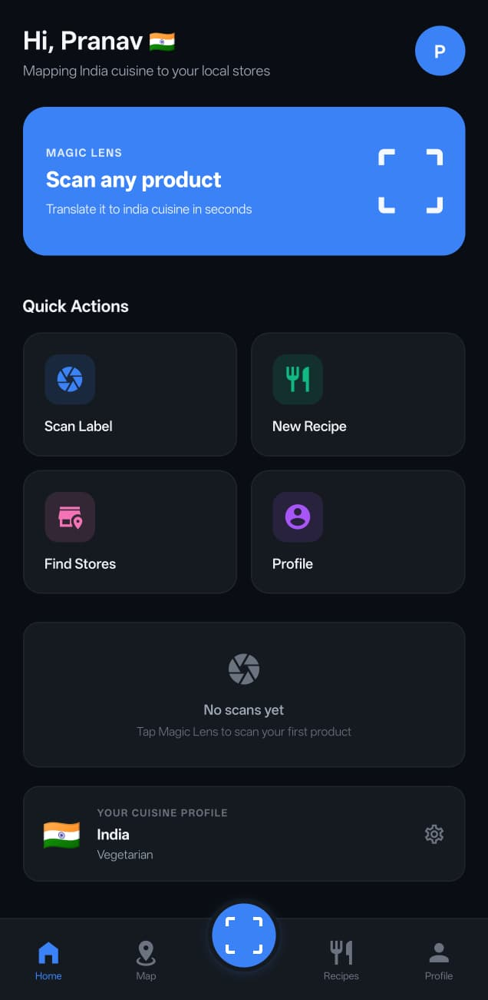
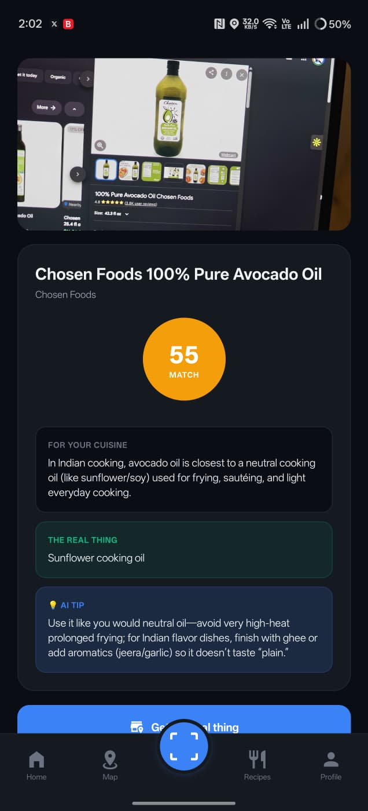
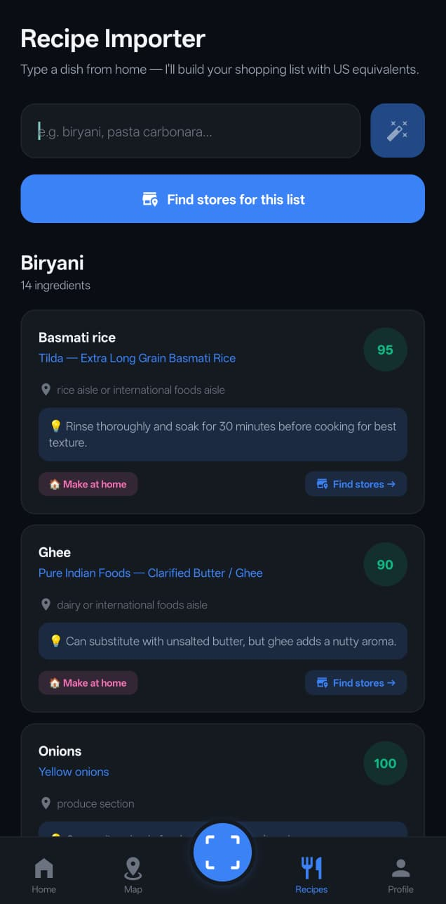
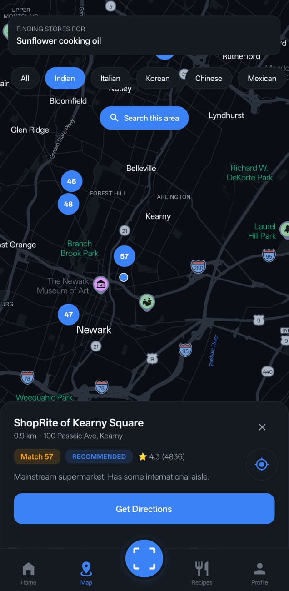
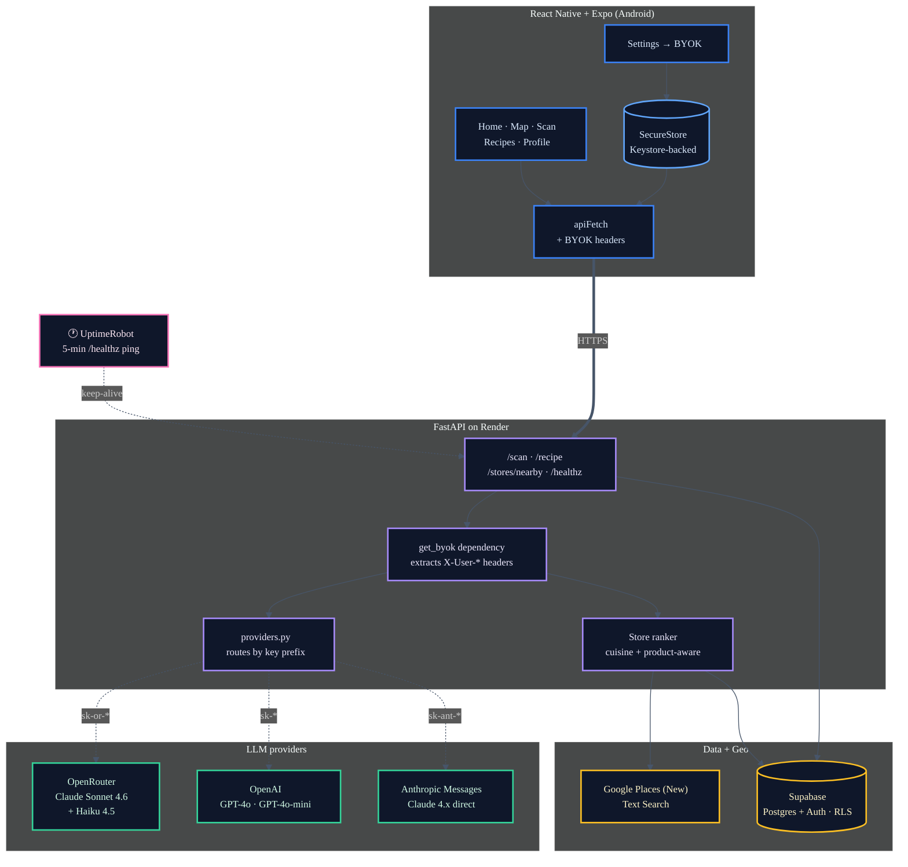
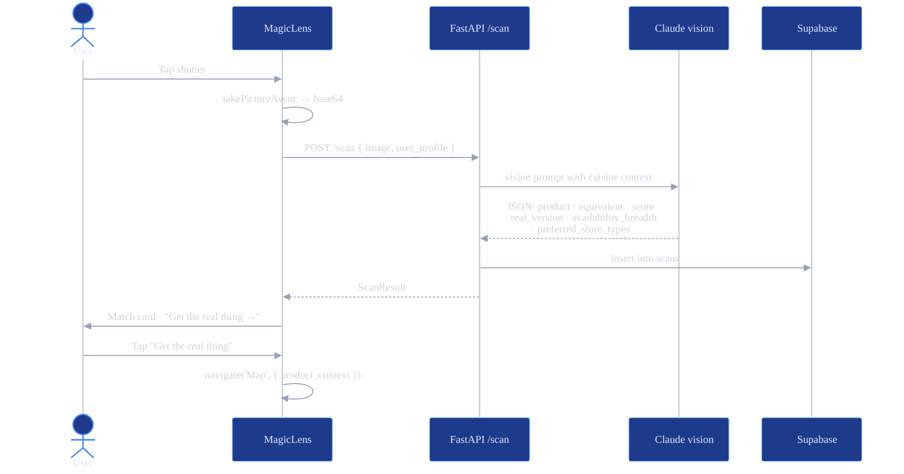
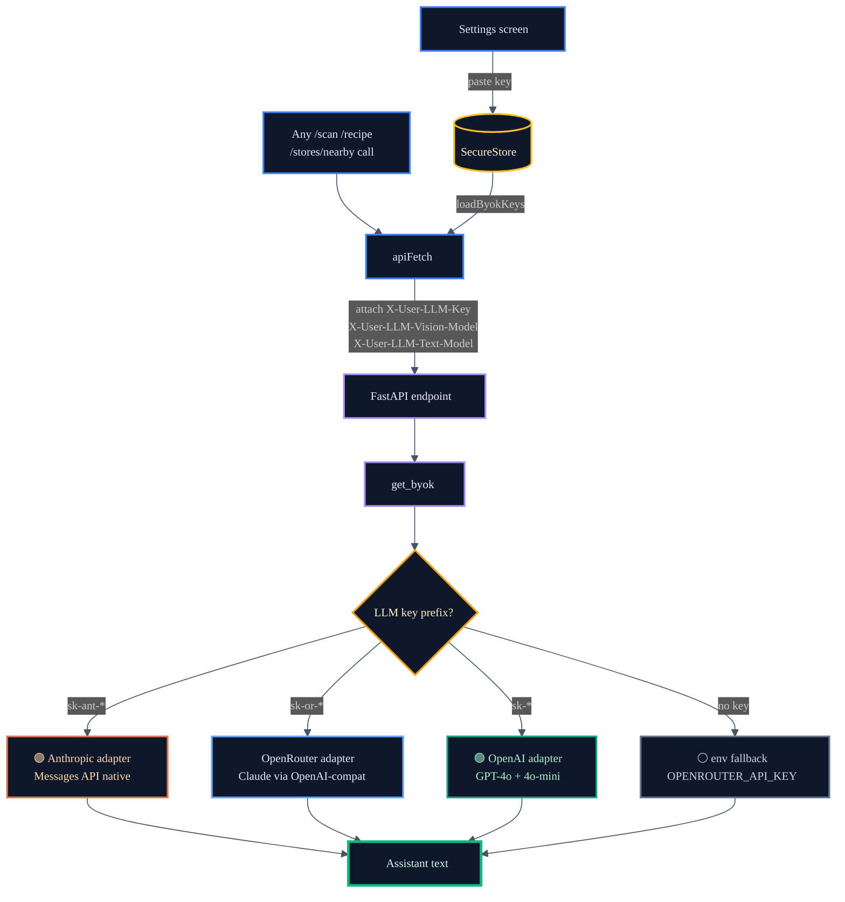
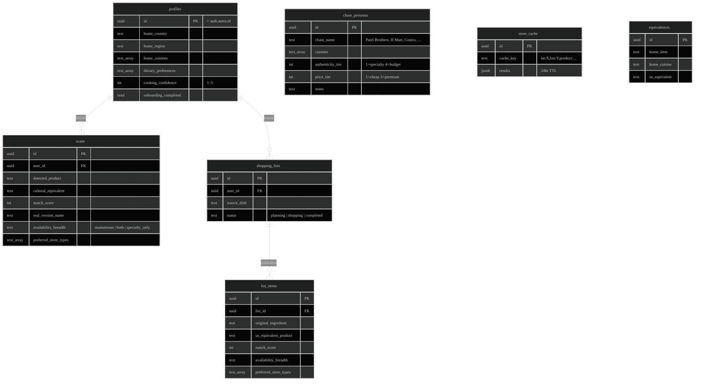

# HomeCart

> Your AI grocery companion for navigating American shelves with home in mind.

HomeCart helps immigrants and travelers translate familiar food products into their US grocery-store equivalents, find specialty stores that carry the *real* thing, and plan recipe shopping trips with confidence. Scan a label, get the cultural translation. Type a dish from back home, get a fully ranked shopping list. Tap **Find stores** — see exactly where the items live, ranked by who covers the most.

Built as a hackathon project (the team won 🥇) and now being polished into a real shippable Android app.

---

## Features

- **🔍 Magic Lens** — point your camera at any US grocery product. Claude vision reads the label, returns a "cultural equivalent" rooted in your home cuisine, a match score, and a *real version* you'd ideally want from a specialty store.
- **📒 Recipe Importer** — type a dish ("biryani", "pasta carbonara"). HomeCart returns 8–15 ingredients each with US equivalents, aisle hints, match scores, and `availability_breadth` classification (mainstream vs specialty).
- **🗺️ Cultural Map** — Google Places-backed map with cuisine filters and product-aware ranking. Specialty-only products (Alphonso mango, fresh paneer) show only ethnic stores; mainstream products (cauliflower, chicken) show closest mainstream + specialty mix. Recipe-coverage view ranks stores by ingredients-covered (e.g., "Patel Brothers — 13/15 items").
- **🔑 BYOK (Bring Your Own Key)** — plug your own OpenRouter / OpenAI / Anthropic key for LLM calls. Provider auto-detected from key prefix (`sk-or-v1-` → OpenRouter, `sk-ant-` → Anthropic, `sk-` → OpenAI). Keys live in hardware-backed secure storage (Android Keystore) and never persist on the backend — they're only forwarded as headers on the specific call that needs them. Maps is operator-managed (quota-capped) so users only manage one key.
- **🌑 Dark mode by default**, theme-aware throughout.
- **Android sideload** via EAS — install from a URL, no Play Store needed.

---

## Demo

| Personalized home | Magic Lens scan | Recipe importer | Cross-feature map |
|---|---|---|---|
|  |  |  |  |
| Cuisine flag, hero CTA, profile snapshot | "Avocado Oil" → match score + "the real thing" + AI tip | "Biryani" → 14 ingredients with brands, aisles, scores | Tap a scan result → map auto-fits to stores carrying it |

---

## Architecture



---

## How it works

### Magic Lens scan flow



### Recipe → store coverage flow

```mermaid
%%{init: {'theme':'dark', 'themeVariables': {'fontSize':'13px', 'fontFamily':'-apple-system, system-ui, sans-serif', 'lineColor':'#475569'}}}%%
flowchart LR
    Dish["📝 'butter chicken'"]:::input --> Recipe["POST /recipe"]:::backend
    Recipe --> Claude["🧠 Haiku 4.5<br/>via OpenRouter"]:::llm
    Claude --> Ings["8-15 ingredients<br/>+ availability_breadth<br/>+ preferred_store_types"]:::data
    Ings --> Save[("💾 Supabase<br/>shopping_lists +<br/>list_items")]:::data
    Ings --> Display["Recipes screen"]:::mobile
    Display --> Either{User picks}
    Either -->|one row| Single["Single-item Map"]:::mobile
    Either -->|Find stores<br/>for this list| Multi["aggregate<br/>product_context"]:::mobile
    Multi --> Nearby["POST /stores/nearby<br/>+ needed_items"]:::backend
    Single --> Nearby
    Nearby --> Places["🗺️ Google Places<br/>Text Search"]:::external
    Nearby --> Personas[("chain_personas<br/>30 chains")]:::data
    Places --> Rank["Per-store coverage"]:::backend
    Personas --> Rank
    Rank --> Filter["Filter 0-coverage<br/>sort distance + coverage"]:::backend
    Filter --> Map["🛒 Patel 13/15<br/>Whole Foods 11/15<br/>Walmart 9/15"]:::result

    classDef input fill:#0F172A,stroke:#94A3B8,stroke-width:2px,color:#F1F5F9
    classDef mobile fill:#0F172A,stroke:#3B82F6,stroke-width:2px,color:#DBEAFE
    classDef backend fill:#0F172A,stroke:#A78BFA,stroke-width:2px,color:#EDE9FE
    classDef llm fill:#0F172A,stroke:#34D399,stroke-width:2px,color:#D1FAE5
    classDef data fill:#0F172A,stroke:#FBBF24,stroke-width:2px,color:#FEF3C7
    classDef external fill:#0F172A,stroke:#F472B6,stroke-width:2px,color:#FCE7F3
    classDef result fill:#0F172A,stroke:#10B981,stroke-width:3px,color:#D1FAE5
```



### BYOK request routing



---

## Tech stack

| Layer | Tech |
|---|---|
| Mobile UI | Expo SDK 54, React Native 0.81, TypeScript, react-native-maps 1.27 |
| Native build | EAS Build (development + preview profiles), expo-dev-client, expo-secure-store, expo-camera, expo-location |
| Navigation | @react-navigation/bottom-tabs 7 |
| Auth + DB | Supabase (Postgres + Auth + RLS) |
| Backend | FastAPI, uvicorn, httpx, Pydantic |
| LLM gateway | OpenRouter (default) → Claude Sonnet 4.6 vision + Haiku 4.5 text. Pluggable: OpenAI direct, Anthropic direct |
| Maps | Google Maps SDK + Places API (New) Text Search |
| Hosting | Render free tier + UptimeRobot keep-alive |
| Secure storage | Android Keystore (hardware-backed) / iOS Keychain |

---

## Getting started

### Prerequisites

- Node 20+
- Python 3.12+
- Supabase project (free tier OK) with Auth enabled
- Google Cloud project with **Places API (New)** + **Maps SDK Android** enabled
- OpenRouter account (or your own OpenAI/Anthropic API key)

### Backend

```bash
cd app/backend
python -m venv venv && source venv/bin/activate
pip install -r requirements.txt

# Create .env (gitignored) with these keys:
cat > .env <<EOF
SUPABASE_URL=https://<project>.supabase.co
SUPABASE_SERVICE_KEY=<service_role_key>
OPENROUTER_API_KEY=sk-or-v1-...
GOOGLE_MAPS_API_KEY=AIza...
ANTHROPIC_API_KEY=sk-ant-...   # optional fallback
EOF

# Apply migrations via Supabase SQL Editor (one at a time):
#   app/migrations/001_initial_schema.sql
#   app/migrations/002_store_cache_chains.sql
#   app/migrations/003_product_availability.sql
#   app/migrations/004_fix_handle_new_user.sql

# Seed the chain_personas table (30 grocery chains classified by cuisine + tier):
python seed_chains.py

# Run dev server (bind 0.0.0.0 so a phone on your LAN can reach it):
uvicorn main:app --host 0.0.0.0 --port 8000 --reload
```

### Frontend

```bash
cd app/frontend
npm install

# Create .env with:
#   EXPO_PUBLIC_API_URL=http://<your-lan-ip>:8000
#   EXPO_PUBLIC_SUPABASE_URL=...
#   EXPO_PUBLIC_SUPABASE_ANON_KEY=...
#   GOOGLE_MAPS_API_KEY=...    # baked into Android native config at prebuild

# Option A — Expo Go for dev (camera + map will be limited):
npx expo start

# Option B — full-feature EAS dev build (recommended):
npx eas-cli@16 build --profile development --platform android
# Install the resulting APK, then run `npx expo start` to serve JS to it
```

---

## BYOK — bring your own key

Tap **Profile → API Keys (BYOK)**. Paste any of:

| Provider | Detected prefix | Where to get it |
|---|---|---|
| OpenRouter | `sk-or-*` | [openrouter.ai/keys](https://openrouter.ai/keys) |
| OpenAI | `sk-*` (anything else) | [platform.openai.com/api-keys](https://platform.openai.com/api-keys) |
| Anthropic | `sk-ant-*` | [console.anthropic.com/settings/keys](https://console.anthropic.com/settings/keys) |
| Google Maps | starts with `AIza` | [console.cloud.google.com/apis/credentials](https://console.cloud.google.com/apis/credentials) |
| Tavily | `tvly-*` | [app.tavily.com/home](https://app.tavily.com/home) |
| Firecrawl | `fc-*` | [firecrawl.dev](https://www.firecrawl.dev/app/api-keys) |

Keys live only in your device's hardware-backed secure store. They're attached as request headers on each API call and **never persisted server-side**. The backend uses them if present, falls back to its env defaults otherwise — so you can run the app even if the operator's free credits run out.

---

## Database schema



All user-owned tables (`profiles`, `scans`, `shopping_lists`, `list_items`) are protected by Row Level Security policies: `auth.uid() = user_id`. The reference tables (`chain_personas`, `store_cache`, `equivalences`) are world-readable by authenticated users.

---

## Deployment

### Backend → Render

```bash
# 1. Push to GitHub.
# 2. Render dashboard → New → Blueprint → pick this repo.
#    Render reads app/backend/render.yaml and provisions a Python service.
# 3. Set env vars in Render: SUPABASE_URL, SUPABASE_SERVICE_KEY,
#    OPENROUTER_API_KEY, GOOGLE_MAPS_API_KEY
# 4. Apply. First deploy takes ~3-5 min.
```

### Keep-alive → UptimeRobot

Render's free tier sleeps after 15 min of inactivity (1-min cold start hurts the demo). UptimeRobot pings `/healthz` every 5 min to keep it warm:

- New monitor → HTTPS → `https://homecart-backend-XXXX.onrender.com/healthz` → 5-minute interval.
- Free plan covers 50 monitors at 5-min intervals. No credit card.

### Mobile → EAS

```bash
cd app/frontend
npx eas-cli@16 build --profile preview --platform android
# Share the resulting EAS build URL — anyone with the URL can sideload the APK.
```

iOS is deferred (requires $99/yr Apple Developer Program). The codebase is iOS-compatible; just no active build path today.

---

## Roadmap

- [x] Magic Lens, Recipe Importer, Map
- [x] Product-aware store ranking (mainstream / specialty / both)
- [x] Per-recipe-ingredient coverage view
- [x] BYOK for LLM, Maps, Tavily, Firecrawl
- [x] OpenRouter LLM gateway with provider fallback
- [x] Android EAS preview build
- [ ] Backend deploy to Render + UptimeRobot keep-alive
- [ ] Tavily fallback for thin-metro store discovery
- [ ] Firecrawl enrichment of `ai_tip` with "where to buy" data
- [ ] iOS build (Apple Developer Program)
- [ ] Play Store listing (privacy policy + content rating + screenshots)
- [ ] App icon + splash branding refresh
- [ ] Sentry crash reporting + PostHog analytics

---

## License

MIT — see [LICENSE](LICENSE) if/when added.

## Acknowledgements

Built by [@p-kowadkar](https://github.com/p-kowadkar) and the hackathon team. Powered by Anthropic Claude (via OpenRouter), Google Maps Platform, and Supabase.
